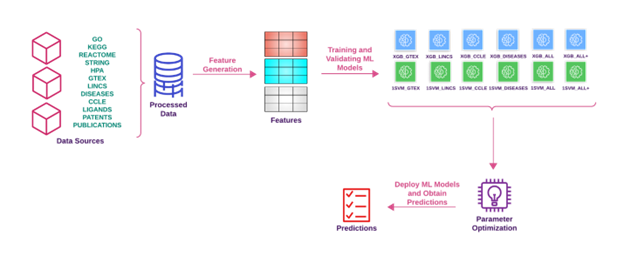

[](https://opensource.org/licenses/MIT)
[](https://www.python.org/)


## :zap: Tclin-like

This repository provides the data, trained ML models, and prediction workflows required to reproduce the analyses reported in the "Temporally Validated Models for Target Druggability" manuscript.  
The study applies XGBoost (XGB) and One-Class Support Vector Machine (1SVM) models to predict the druggability of protein targets (Tclin-like/druglikeness) using features derived from Gene Tissue Expression (GTEX), Cancer Cell Line Encyclopedia (CCLE), DISEASES (Jensen Lab), Library of Integrated Network-based Cellular Signatures (LINCS), and evidence from publications, patents, and known ligands. 

[Link to the manuscript To be added](TBA)  



---

## 📁 `data/`

- Preprocessing data for year 2018 and 2023
- Curated lists of Tclin and Non-Tclin proteins used for model training 

---

## 💾 `saved_models/`

- Fully trained XGB models
- Fully trained 1SVM models
- Models are saved to support reproducibility without retraining

---

## 🔁 `train_predict/`

- Training notebooks for XGB and 1SVM models
- Prediction notebooks used to generate manuscript results

---

## 📊 `Supplementary/`

- Supplementary Table S1: Predictions for over 18,000 proteins and comparison across Tclin-like scores, Drugnome AI, PINNED, and DrugHunter.  
- Predicted druggability scores for proteins that received Tclin designation in 2024, as reported in the manuscript in Table 6.

| Drug Name      | Gene Symbol | Target Class       | Tclin-like Score | PINNED Score | DrugnomeAI Score | Tclin Designation Year |
|----------------|------------|-----------------|----------------|--------------|----------------|----------------------|
| Revumenib          | MEN1       | Transcriptional regulator           | 8           | 20.73         | 0.19           | 2024                 |
| Danicopana          | CFD       | Enzyme           | 8           | 33.76         | 0.54           | 2024                 | 
| Zenocutuzumab          | ERBB3       | Kinase         | 8           | NA         | NA           | 2024                 |
| Tarlatamaba          | DLL3      | Tumour-associated antigen    | 5           | 1.27         | 0.08           | 2024                 |
| Zolbetuximaba          | CLDN18.2      | Cell junction protein    | 8           | 2.30         | 0.218           | 2024                 |
| Nogapendekin alfa inbakicept   | IL15RA       | Cytokine receptor            | 8           | 5.62         | 0.44           | 2024                 |
| Sotatercept          | INHBA, INHBB   | Cytokine      | 8 (both)           | 10.28, 16.66         | 0.76, 0.39           | 2024                 |
| Imetelstat          | TERT        | Enzyme         | 8           | 1.93         | 0.96           | 2024                 |


---


## :paperclip: Citation 
Quazi, Mohammed, et al. "Temporally Validated Models for Target Druggability." Journal TBA (2026).
```bib
@article{Quazi2026Tclin,
      title={Temporally Validated Models for Target Druggability}, 
      author={Mohammed Quazi and Suman Sirimulla and Cristian G Bologa and Alexei Pushechnikov and Bill Farley and Nikolay Savchuk and Tudor I. Oprea},
      year={2026},
      publisher={TBA}
}
```
